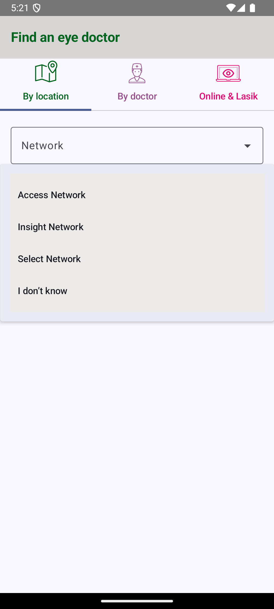
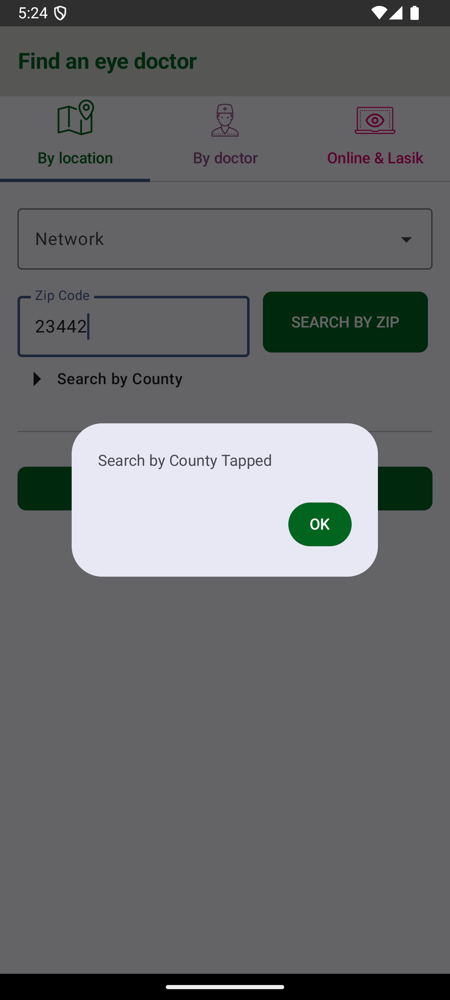
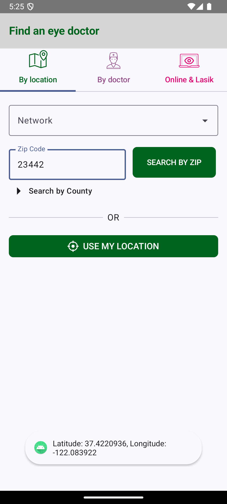
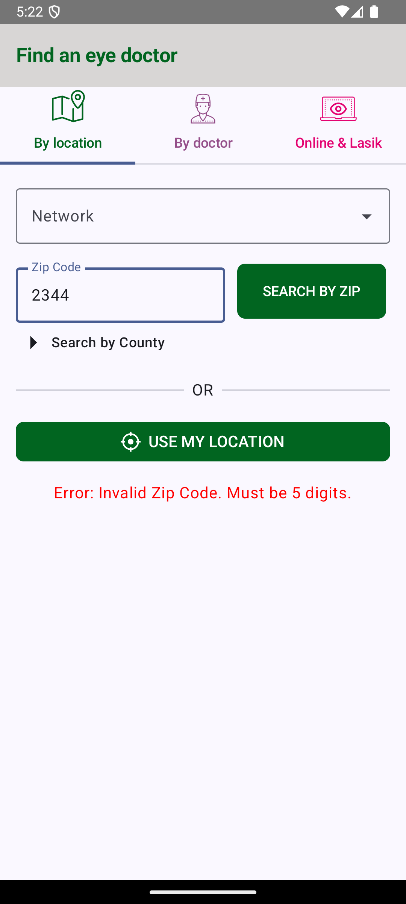

# Eyedoc Locator App

This project demonstrates the implementation of a multi-tab screen using **Jetpack Compose** and **MVVM Architecture**. The app includes functionalities for network selection, zip code validation, and location-based operations, with clear separation of concerns between the UI, ViewModel, and Service layers.

## Features

### Tab Navigation
- **By Doctor Tab**: Displays "By doctor" when tapped.
- **Online & Lasik Tab**: Displays "Online & Lasik" when tapped.
- **By Location Tab**: 
  - Displays a list of network values:
    - Access Network
    - Insight Network
    - Select Network
    - I don't know
  - Includes buttons for:
    - **Search by Zip**:
      - Verifies if a valid 5-digit zip code is entered.
      - Makes an HTTP POST request with the entered zip code.
      - Logs the HTTP response to the console.
    - **Search by County**:
      - Displays an alert: "Search by County Tapped."
    - **Use My Location**:
      - Requests the device location using Android APIs (no further action required).

## Architecture
The project follows the **MVVM architecture** with the following structure:
1. **UI Layer**:
   - Jetpack Compose is used to build the screen and tabs.
2. **ViewModel Layer**:
   - Handles the business logic and prepares data for the UI.
3. **Service Layer**:
   - Contains the HTTP call logic for the zip code search.
   - Ensures separation of concerns by isolating network operations from the ViewModel.

## Setup Instructions

1. Clone the Repository:
   ```bash
   git clone <repository-url>
   cd <repository-folder>
   ```
2. Open the project in Android Studio.
3. Build and run the app on an emulator or physical device.

## Screenshots

<table>
  <tr>
    <td></td>
    <td></td>
    <td></td>
    <td></td>
    <td></td>
  </tr>
</table>


